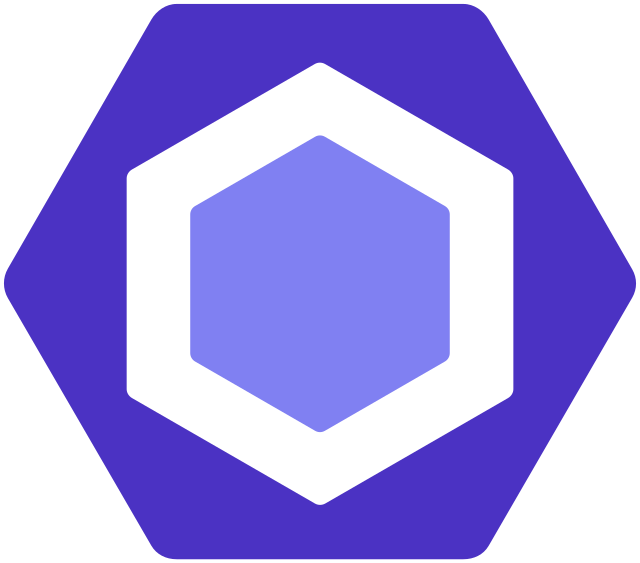

# Hi there 👋 I am Front-end web developer Junjie.

- I'm an open source enthusiast.
- Email: junjieweb@qq.com

 
 

<!-- 

 -->
 
### Languages and Tools​:computer:

[开源开发许可证 - 社区支持](https://www.jetbrains.com/zh-cn/community/opensource/#support)

JetBrains 通过为核心项目贡献者免费提供一套一流的开发者工具来支持非商业开源项目。

<!-- 本地版
### Languages and Tools​:computer:

 
-->

<!-- 
**Languages and Tools​:computer:**  

<code></code>
<code></code>
<code></code>
<code></code>
<code></code>
<code></code>
<code></code>
<code></code>
<code></code>
<code></code>

<code></code>
<code></code>
<code></code>
<code></code>
<code></code>
<code></code>
<code></code>
<code></code>
<code></code>
<code></code> 
-->
 
 
<!--
**junjieweb/junjieweb** is a ✨ _special_ ✨ repository because its `README.md` (this file) appears on your GitHub profile.

Here are some ideas to get you started:

- 🔭 I’m currently working on ...
- 🌱 I’m currently learning ...
- 👯 I’m looking to collaborate on ...
- 🤔 I’m looking for help with ...
- 💬 Ask me about ...
- 📫 How to reach me: ...
- 😄 Pronouns: ...
- ⚡ Fun fact: ...
-->

